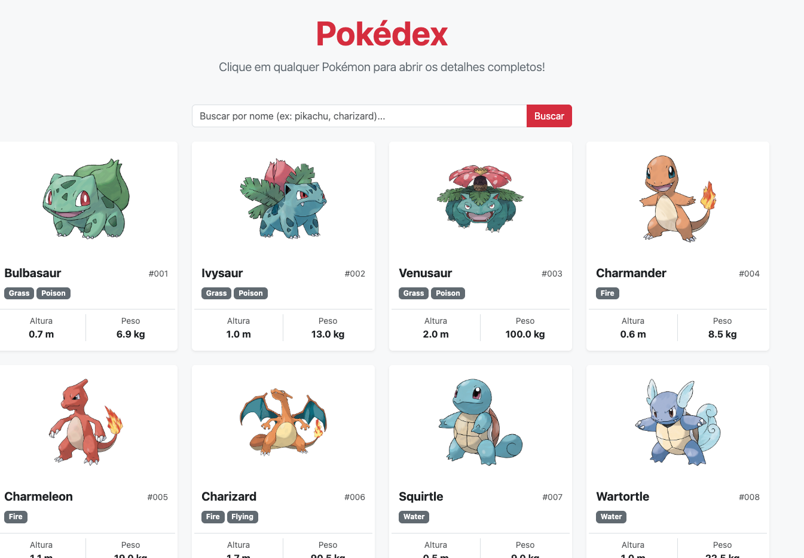
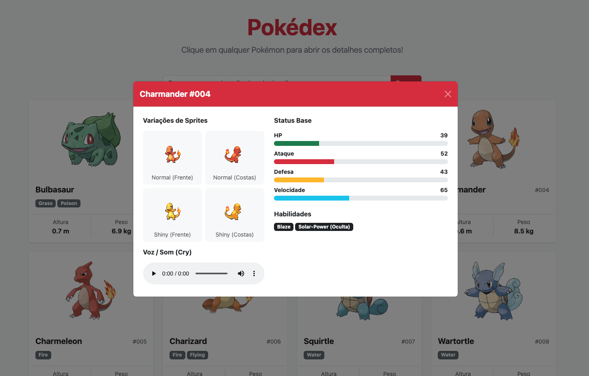

# Prática Guiada: Pokédex Assíncrona com Fetch API e Bootstrap

Este repositório contém uma aplicação web interativa desenvolvida com **HTML5**, **Bootstrap 5** e **JavaScript (ES6+)**. O objetivo principal desta aula/laboratório é praticar a consumo de APIs RESTful usando a `Fetch API`, manipulação assíncrona com `async/await` e manipulação dinâmica do DOM.

---

## 🎯 Objetivos do Aprendizado

- Compreender o funcionamento de requisições HTTP assíncronas utilizando a **Fetch API**.
- Trabalhar com **Promises**, `async/await` e o método `Promise.all` para requisições paralelas.
- Tratar cenários de sucesso, erro e carregamento (*loading state*).
- Manipular elementos do DOM dinamicamente com Template Literals.
- Construir uma interface responsiva e moderna utilizando **Bootstrap 5**.

---

## 🛠️ Tecnologias e Recursos Utilizados

### 1. **HTML5 e CSS3**
- Estrutura semântica (`<header>`, `<main>`, `<script>`).
- Efeitos visuais simples via CSS (transição suave de *hover* e elevação nos cards).

### 2. **Bootstrap 5 (via CDN)**
- **Grid System Responsivo**: Uso de `row-cols-1 row-cols-sm-2 row-cols-md-3 row-cols-lg-4` para adaptar a quantidade de colunas de acordo com a tela.
- **Componentes**: `card`, `badge`, `input-group`, `spinner-border` e `alert`.
- **Utilitários de Flexbox e Espaçamento**: `d-flex`, `justify-content-between`, `py-5`, `mb-4`, etc.

### 3. **JavaScript (ES6+) & Web APIs**
- **Fetch API**: Requisições HTTP nativas do navegador para obter dados no formato JSON da [PokéAPI](https://pokeapi.co/).
- **`async / await`**: Sintaxe limpa e legível para tratamento de Promises.
- **`Promise.all()`**: Utilizado para buscar os detalhes individuais de múltiplos Pokémon em paralelo, otimizando o tempo de carregamento da página.
- **Manipulação do DOM**: Uso de `insertAdjacentHTML` e `innerHTML` para renderização dinâmica das cartas.
- **Manipulação de Strings e Números**: Uso de `padStart` para formatar os IDs (`#001`, `#025`) e operações matemáticas para conversão de decímetros/hectogramas para metros/quilogramas.

---

## 📂 Estrutura do Código Explicação Passo a Passo

1. **Constantes e Seletores**: Mapeamento dos elementos HTML (`input`, `button`, `grid`, `loading`) que sofrerão interações.
2. **`fetchPokemonData(urlOrName)`**: Função auxiliar que decide se a busca é por URL completa ou por nome/ID digitado no campo de busca.
3. **`loadInitialPokemon(limit)`**: 
   - Faz a requisição inicial da lista de Pokémon.
   - Extrai as URLs individuais e usa `Promise.all` para carregar todas em paralelo.
   - Chama a função de renderização para cada Pokémon retornado.
4. **`renderPokemonCard(pokemon)`**: Monta o componente HTML do card com imagem oficial, tipos (badges), altura e peso, inserindo-o no container da página.
5. **`handleSearch()`**: Captura a busca do usuário. Se o campo estiver vazio, recarrega os primeiros 20; caso contrário, busca o Pokémon específico digitado.
6. **Controle de Estado de Interface**: Funções `showLoading` e `showError` para garantir feedback visual apropriado durante as requisições.

---

## 🚀 ORIENTAÇÕES - DESAFIO PRÁTICO PARA OS ALUNOS

Agora é a sua vez! O objetivo deste desafio é estender a Pokédex adicionando uma funcionalidade de **Modal de Detalhes Completo**.

### 📋 Requisitos do Desafio

Ao clicar em qualquer card de Pokémon, a aplicação deve abrir um **Modal do Bootstrap** contendo informações detalhadas do Pokémon selecionado.

#### 1. Propriedades a Exibir no Modal:
- **Status Base (Stats)**: Exibir barras de progresso (`progress bar` do Bootstrap) para os status:
  - *HP* (`hp`)
  - *Ataque* (`attack`)
  - *Defesa* (`defense`)
  - *Velocidade* (`speed`)
- **Habilidades (Abilities)**: Listar as habilidades do Pokémon (ex: *Overgrow*, *Chlorophyll*).
- **Sons / Cries (Áudio)**: Adicionar um botão ou player de áudio HTML5 (`<audio>`) para reproduzir o som oficial do Pokémon (`cries.latest` ou `cries.legacy`).
- **Galeria de Sprites (Frente e Costas)**: Mostrar as variações Normal e Shiny (usando `sprites.front_default`, `sprites.back_default`, `sprites.front_shiny`, `sprites.back_shiny`).

---

### 💡 Dicas de Implementação

1. **Adicionar o Modal ao HTML**:
   Inclua a estrutura base de um [Modal do Bootstrap 5](https://getbootstrap.com/docs/5.3/components/modal/) no seu `index.html`.

   ```html
   <!-- Modal de Detalhes -->
   <div class="modal fade" id="pokemonModal" tabindex="-1" aria-hidden="true">
     <div class="modal-dialog modal-dialog-centered">
       <div class="modal-content">
         <div class="modal-header">
           <h5 class="modal-title text-capitalize" id="pokemonModalTitle">Detalhes</h5>
           <button type="button" class="btn-close" data-bs-dismiss="modal" aria-label="Close"></button>
         </div>
         <div class="modal-body" id="pokemonModalBody">
           <!-- Conteúdo inserido dinamicamente via JS -->
         </div>
       </div>
     </div>
   </div>
   ```

2. **Tornar o Card Clicável**:
   No `renderPokemonCard`, adicione um evento de clique ou atributos do Bootstrap para abrir o modal e passar o ID do Pokémon.

   *Exemplo adicionando classe e dataset no card:*
   ```javascript
   // No HTML retornado pelo renderPokemonCard, adicione:
   // style="cursor: pointer;" onclick="openPokemonModal(${pokemon.id})"
   ```

3. **Função de Modal no JavaScript**:
   Crie uma função `openPokemonModal(id)` que busque os dados (ou reutilize se tiver guardado em cache) e preencha o corpo do modal:

   ```javascript
   async function openPokemonModal(id) {
     const pokemon = await fetchPokemonData(id);
     
     // 1. Extrair stats (hp, attack, defense, speed)
     // 2. Extrair habilidades
     // 3. Extrair áudio de cries
     // 4. Montar o HTML interno do modal e exibir via Bootstrap JS API
     
     const modalElement = document.getElementById('pokemonModal');
     const modal = new bootstrap.Modal(modalElement);
     modal.show();
   }
   ```

4. **Componente de Barras de Progresso (Bootstrap)**:
   Para os atributos/stats, você pode renderizar a barra assim:
   ```html
   <div class="mb-2">
     <small class="fw-bold">Ataque: 49</small>
     <div class="progress" style="height: 10px;">
       <div class="progress-bar bg-danger" role="progressbar" style="width: 49%;" aria-valuenow="49" aria-valuemin="0" aria-valuemax="100"></div>
     </div>
   </div>
   ```

---



